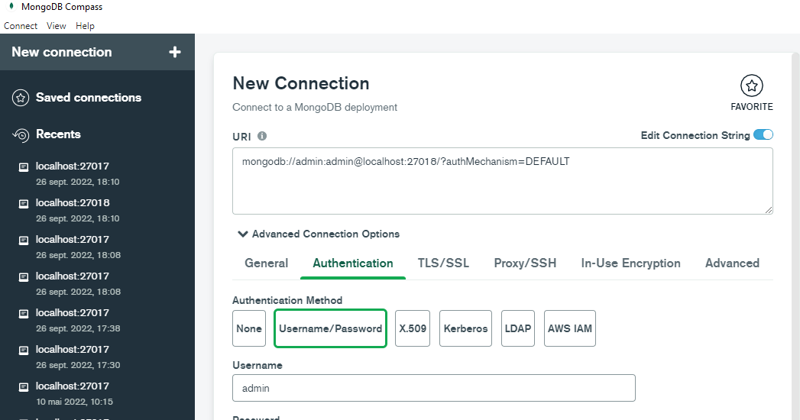

# Lancer le projet
Utilisez la commande "docker-compose up -d" dans un terminal a la racine du projet. Le docker est maintenant lancé et accessible depuis le port local 27018.
# Se connecter à mongo
pour se connecter en local a la base de donnée (en dehors du container docker), nous devons utiliser les paramètres suivants :
